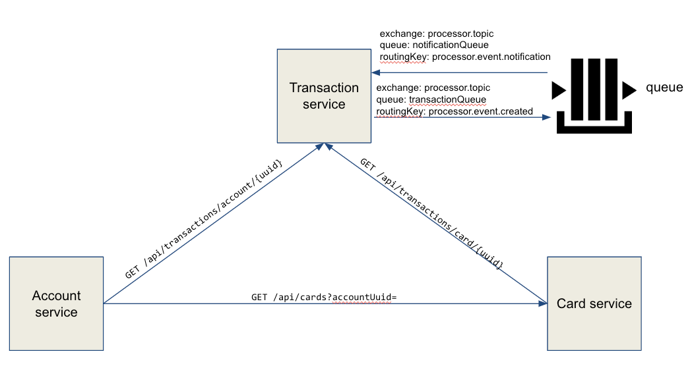
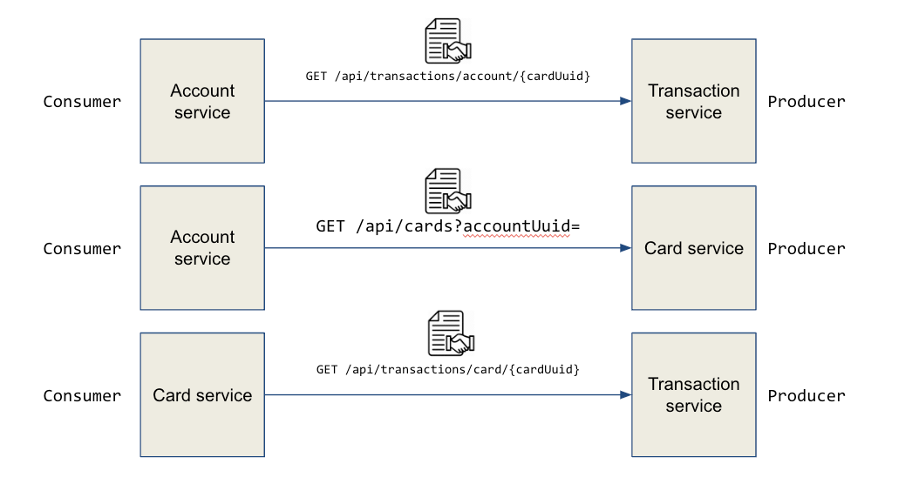
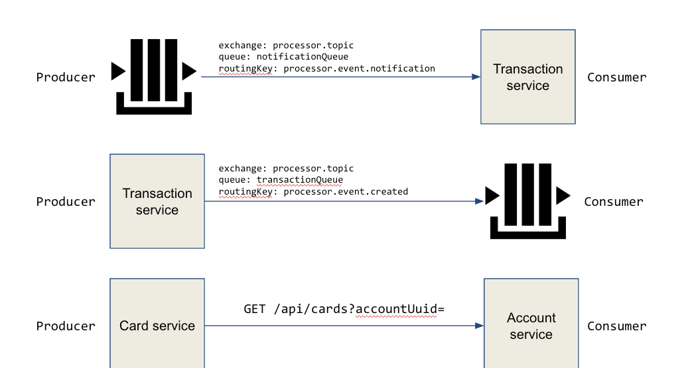

# ms-cdc-project
Micro services using Consumer Driven Contract

# About CDC
Consumer-Driven Contracts (CDC) is a pattern for evolving services. In Consumer-Driven Contracts, each consumer captures their expectations of the provider in a separate contract. All of these contracts are shared with the provider so they gain insight into the obligations they must fulfill for each individual client.

## Producer/Provider
The producer is a service that exposes an API (e.g. rest endpoint) or sends a message (e.g. Kafka Producer which publishes the message to Kafka Topic)
## Consumer
The consumer is a service that consumes the API that is exposed by the producer or listens to a message from the producer (e.g. Kafka Consumer which consumes the message from Kafka Topic)

# Example project setup

## Contracts between services

This monorepo created from GitLab repositories: